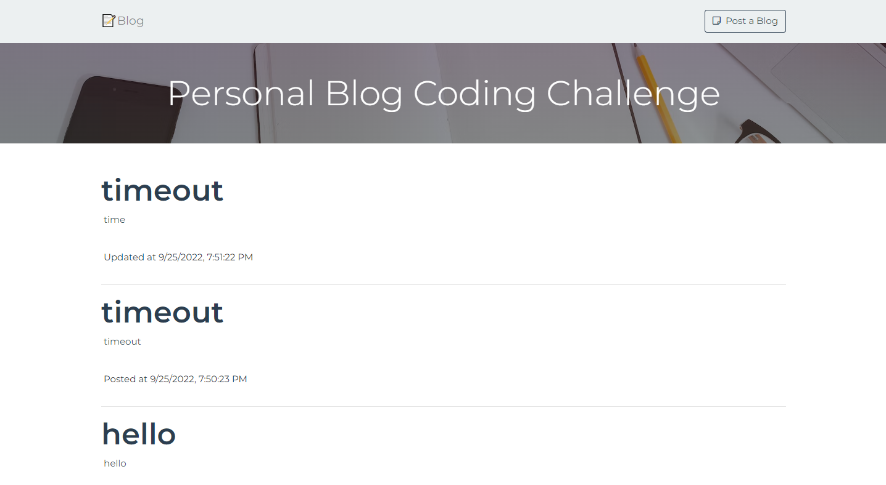
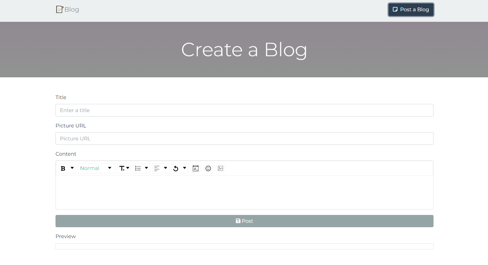
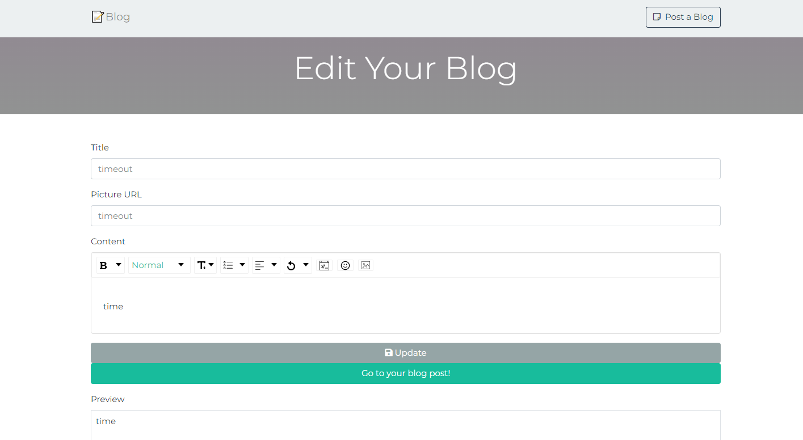

<h2 align="center">
  Personal Blog - Coding Challenge
</h2>

<center>

[](https://forthebadge.com) &nbsp;

</center>

## MERN Technology

This is a simple blog website that allows users to add new articles and perform basic CRUD operations. It is built using the following technologies:

- [React](https://facebook.github.io/react/) and [Axios](https://axios-http.com/docs/intro) for the frontend
- [Express](http://expressjs.com/) and [Mongoose](http://mongoosejs.com/) for the backend
- [Eslint](https://eslint.org), [Prettier](https://prettier.io) and [Airbnb](https://github.com/airbnb/javascript) for coding style, code formatting and style guide of best practices for quality code respectively.

## Requirements

First of all setting and running server/backend can be favourable.

### Server

- [Node.js](https://nodejs.org/en/) 6+

```shell
npm install
```

I use yarn because of it's speed and performance over npm since it performs parallel installation.

```shell
npm install --global yarn
```

Check yarn version

```shell
yarn --version
```

-[MongoDB](https://www.mongodb.com)

### Client

- [ReactJS](https://reactjs.org)

```shell
yarn create react-app my-app --template typescript
```

## Running

Make sure to make a `.env` file from the copy of `.env.example` file.

### Server

The following command will install all the packages required with the help of package.json file.

```shell
yarn
```

This command will start the server in the port mentioned in its .env file.

```shell
yarn start
```

### Client

After the server is up and running change the base url in the client again in the `.env` file and run the above command similar to the server but inside the **Client Directory**.

**Note:** Add `REACT_APP_` prefix to the variable name in `.env` file in react.

## Available Commands

1. `yarn` - install packages

2. `yarn start` - starts the development server with hot reloading enabled

3. `npx kill-port port_number` - to kill any process in the port_number

## TODO

- **Testing**
- **Validation**
- **Authentication**
- **Image Upload**

## Snippets

<div align="center">
  
</div>

<div align="center">
  
</div>

<div align="center">
  
</div>
